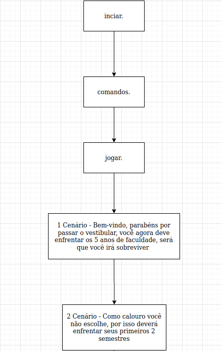
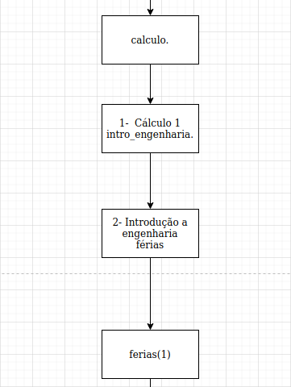

# EscapeFGAtes

**Disciplina**: FGA0210 - PARADIGMAS DE PROGRAMAÇÃO - T01  
**Nro do Grupo**: 04 
**Paradigma**: Lógico 

## Alunos
|Matrícula | Aluno |
| -- | -- |
| 17/0056155 | André Freitas |
| 17/0013693 | João Gabriel Rossi |
| 17/0113060 | Pedro Vítor de Salles Cella |
| 17/0045269 | Sara Campos |

## Sobre 
Escape FGAtes é um RPG de texto que se passa no ambiente da Faculdade do Gama, o objetivo do jogo é que o usuário, um aluno de engenharia, forme em 5 anos, para que isso ocorra ele passará por 5 níveis, correspondentes aos 5 anos de curso e cada ano possuirá 2 matérias que representam os semestres cursados, e caso o usuário falhe 3 vezes num mesmo desafio ele será jubilado e o jogo acaba, porém se o usuário passar em todos os desafios ele se forma e ganha o jogo.

## Screenshots
Adicione 2 ou mais screenshots do projeto em termos de interface e/ou funcionamento.

## Instalação 
**Linguagens**: Prolog 

Para você rodar o projeto deve-se primeiramente ter o Prolog instalado, no caso usaremos o SWI Prolog, para instalar é simples: 

No terminal...

`sudo apt-add-repository ppa:swi-prolog/stable` 
`sudo apt-get update` 
`sudo apt-get install swi-prolog` 

## Uso 

Primeiramente baixa o projeto EscapeFGAtes,verifique se possui o arquivo <i>escapefgates.pl</i>, confirmado inicie o Prolog no terminal dentro da pasta em que o mesmo se encontra 
O arquivo deve aparecer exatamente como demonstrado abaixo: 

`exemplo@Notebook:~/Documents$ ls` 
`exemplo@Notebook:~/Documents$ escapefgates.pl` 

Para iniciar o projeto basta iniciar o SWI Prolog: 

`exemplo@Notebook:~/Documents$ swipl`

Com o Prolog iniciado você deve carregar o projeto:

`?- [escapefgates].` 

Com o projeto carregado basta inserir um `iniciar.` e começar a jogar :)

## Vídeo
Adicione 1 ou mais vídeos com a execução do projeto.

## Outros 
Abaixo temos algumas fotos para o diagrama que foi criado com o intuito de esclarecer os possíveis caminhos a serem percorridos, caso não seja nítido será deixado também o link.

link para o diagrama completo: https://drive.google.com/file/d/1-qzk1W7yoi50cC9xhuK9kmX4NbBg64lz/view?usp=sharing
## Fontes
Caso utilize materiais de terceiros, referencie-os adequadamente.
